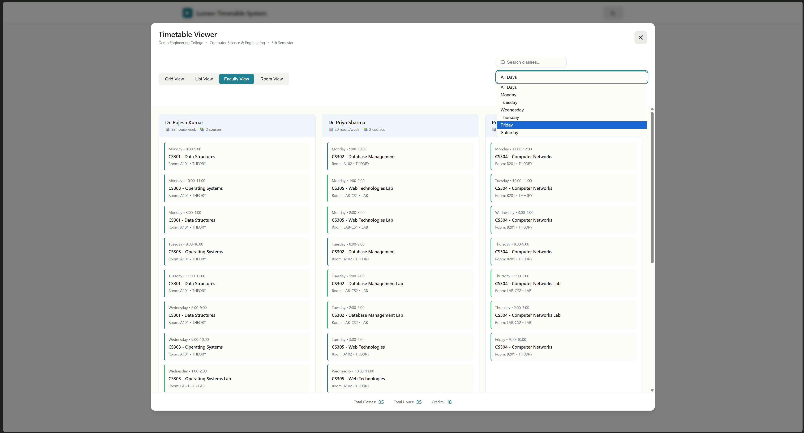
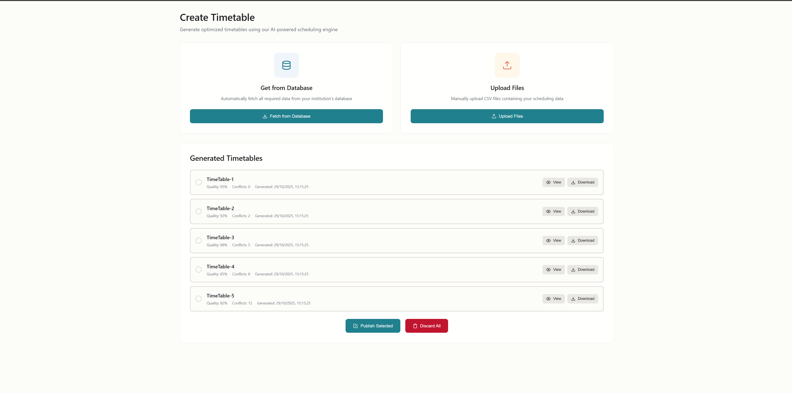

# LUMEN TimeTable Management System

**A Mathematically rigorous, production-grade automated timetable scheduling system that integrates advanced optimization algorithms—constraint programming, meta-heuristics, and hybrid solvers — to deliver conflict-free, resource-optimal schedules at institutional scale within strict computational budgets, demonstrating measurable improvements in schedule quality, system reliability, and operational efficiency.**

---

## Team Information

**Team Name:** LUMEN

**Team Lead:** S. N. Chakri M. (Shiva Naga Chakri M.) 

**LinkedIn Profile:** [https://www.linkedin.com/in/snchakri/]

---

## Overview

**LUMEN TimeTable Management System** is a comprehensive system designed to solve complex institutional scheduling problems through advanced optimization algorithms, multi-objective constraint satisfaction, and an intuitive workflow-based management interface. The system ensures NEP-2020 policy compliance while delivering conflict-free timetables with optimal resource utilization.

### Key Features

- **Advanced Scheduling Engine**: Multi-solver architecture supporting 20+ configurable parameters for institutional scheduling
- **NEP-2020 Compliance**: Built-in validation ensuring adherence to national education policy requirements
- **Multi-Objective Optimization**: Balances faculty workload, student preferences, room utilization, and institutional constraints
- **Workflow Management**: Role-based approval system with parallel workflow chains for institutional governance
- **Real-time Validation**: Comprehensive input validation with detailed error reporting and feasibility checking
- **Scalable Architecture**: Handles all institutions of 100+ types, and deployable across entire nation of India
- **Performance**: Sub-5-minute processing for standard institutional workloads (with 2K+ students, 200+ courses, 300+ faculty workloads)

### System Architecture

```
┌─────────────────────────────────────────────────────────────────┐
│                    LUMEN TTMS Architecture                      │
├─────────────────────────────────────────────────────────────────┤
│                                                                 │
│  ┌──────────────┐     ┌──────────────┐     ┌──────────────┐     │
│  │   Web App    │───▶ │  Scheduling  │───▶│   Database   │     │
│  │ (Management) │     │    Engine    │     │  (PostGreSQL)│     │
│  └──────────────┘     └──────────────┘     └──────────────┘     │
│         │                     │                                 │
│         │                     │                                 │
│         ▼                     ▼                                 │
│  ┌──────────────┐    ┌──────────────┐                           │
│  │   Workflow   │    │ Test Suite   │                           │
│  │   System     │    │  Generator   │                           │
│  └──────────────┘    └──────────────┘                           │
│                                                                 │
└─────────────────────────────────────────────────────────────────┘
```

## Project Structure

```
lumen_25028_ttms/
├── web_app/                    # Frontend management interface
│   ├── login/                  # Authentication module
│   ├── viewtt/                 # Timetable viewing & visualization
│   ├── creatett/               # Timetable creation & pipeline management
│   ├── workflow/               # Approval workflow interface
│   ├── history/                # Timetable history & versioning
│   └── access_control_mngmt/   # User & role management (RBAC)
│
├── scheduling_system/          # Core scheduling engine (7-stage pipeline)
│   ├── stage_1/                # Input validation & parameter loading
│   ├── stage_2/                # Student batching with CP-SAT optimization
│   ├── stage_3/                # Data compilation & optimization
│   ├── stage_4/                # Feasibility checking
│   ├── stage_5/                # Complexity analysis & solver selection
│   ├── stage_6/                # Optimization execution (4 solver families)
│   │   ├── pulp_family/        # MILP solvers (CBC, GLPK, Gurobi, CPLEX)
│   │   ├── pygmo_family/       # Meta-heuristics (NSGA-II, MOEAD, IHS)
│   │   ├── or_tools_family/    # Google OR-Tools CP-SAT solver
│   │   └── deap_family/        # Evolutionary algorithms (GA, ES, DE, PSO)
│   ├── stage_7/                # Output validation & formatting
│   └── shared/                 # Shared utilities & logging
│
├── test_suite_generator/       # Synthetic test data generation
│   ├── src/                    # Generator core implementation
│   ├── config/                 # Configuration templates
│   └── data/                   # Generated test datasets
│
├── db_sql_files/               # Database schemas
│   ├── hei_timetabling_datamodel.sql    # Scheduling data model
│   └── management-system-schema.sql     # Management system schema
│
├── docs/                       # System documentation
│   └── [See docs folder for detailed technical & user guides]
│
├── archive/                    # UI screenshots & presentation assets
└── tests_samples/              # Sample test cases and validation data
    └── [To be populated with validation samples]
```

## Management System Interface

The LUMEN management system provides an intuitive web-based interface for institutional administrators to manage the scheduling process with role-based access control and comprehensive workflow management.

### Login & Authentication

Secure role-based authentication supporting multiple institutions with credential management and session control.


*Multi-institution selector with secure credential management*


*Institution selection for multi-tenancy support*

### Access Control Management

Quad-tier RBAC system for granular permission management across organizational hierarchy.


*User and role management dashboard*


*Hierarchical role configuration interface*


*Role assignment and permission management*

### Workflow Management

Parallel approval chains with real-time notifications and status tracking for institutional governance.


*Timetable workflow status and approval tracking*


*Detailed workflow information modal*


*Approval/disapproval interface with notes*

### Timetable History

Version control and audit trail for all scheduling iterations with change tracking and rollback capabilities.


*Complete timetable version history and audit log*


*Detailed view of historical timetable versions*

### Timetable Viewing & Visualization

Multiple view modes for comprehensive timetable analysis with real-time filtering and search capabilities.


*Main timetable viewing interface with multiple visualization options*



*Faculty-centric view showing individual teaching schedules*


*Grid layout for day-wise and timeslot-wise visualization*


*Detailed list view with sorting and filtering options*


*Room-based view showing utilization and allocation*

### Timetable Creation & Management

Comprehensive interface for creating new timetables with dual data input modes and full pipeline integration.


*Main creation dashboard with statistics and navigation*



*Success confirmation after timetable creation*


*File upload modal for batch data input*


*Upload modal showing selected files for processing*


*Database fetch mode for direct data retrieval*


*Database interface with fetched data preview*


*Success modal after timetable publication*

## Scheduling System

The core scheduling engine implements a 7-stage data pipeline that transforms raw institutional data into optimized, conflict-free timetables.

### Pipeline Architecture

1. **Stage 1 - Input Validation**: Multi-layer validation (syntactic, semantic, business rules) with dynamic parameter loading
2. **Stage 2 - Student Batching**: Intelligent student batch formation using CP-SAT optimization with similarity-based clustering
3. **Stage 3 - Data Compilation**: Normalization, relationship mapping, and index optimization
4. **Stage 4 - Feasibility Check**: Constraint satisfaction validation before optimization
5. **Stage 5 - Complexity Analysis**: Problem size analysis and optimal solver selection
6. **Stage 6 - Optimization**: Multi-solver execution with 4 solver families and fallback strategies
   - **PuLP Family**: MILP solvers (CBC, GLPK, Gurobi, CPLEX)
   - **PyGMO Family**: Meta-heuristic algorithms (NSGA-II, MOEAD, IHS, SADE)
   - **OR-Tools Family**: Google's constraint programming CP-SAT solver
   - **DEAP Family**: Evolutionary algorithms (GA, GP, ES, DE, PSO, NSGA-II)
7. **Stage 7 - Output Validation**: 12-threshold validation ensuring schedule quality

See [`scheduling_system/README.md`](scheduling_system/README.md) for detailed documentation.

## Test Suite Generator

Synthetic data generation system for comprehensive testing and validation of the scheduling engine across diverse institutional scenarios.

Features:
- NEP-2020 compliant synthetic data generation
- Configurable complexity levels (small, medium, large institutions)
- Type I (mandatory) and Type II (optional) data entities
- Validation layer integration

See [`test_suite_generator/README.md`](test_suite_generator/README.md) for detailed documentation.

## Database Schema

Comprehensive relational database design supporting both the scheduling engine and management system.

- **HEI Timetabling Data Model**: 20+ parameter categories including faculty, courses, rooms, timeslots, and constraints
- **Management System Schema**: User authentication, role management, workflow states, and audit logging

See [`db_sql_files/README.md`](db_sql_files/README.md) for schema documentation.

## Technology Stack

### Core Scheduling Engine
- **Language**: Python 3.8+
- **Optimization**: PuLP, PyGMO, Google OR-Tools, DEAP
- **Data Processing**: Pandas, NumPy, SciPy
- **Validation**: NetworkX for relationship analysis

### Management System
- **Backend**: Node.js, Express, RESTful APIs
- **Frontend**: React, TypeScript, Material-UI
- **Database**: PostgreSQL with time-series support
- **Authentication**: JWT, NestJS Passport

### Infrastructure
- **Containerization**: Docker, Docker Compose
- **Caching**: Redis
- **Load Balancing**: Built-in horizontal scaling support

## Quick Start

### Prerequisites
- Python 3.8 or higher
- Node.js 14+ (for web application)
- PostgreSQL 12+ (for database)
- Docker & Docker Compose (optional, for containerized deployment)

### Installation

1. **Clone the repository**
   ```bash
   git clone https://github.com/snchakri/lumen_25028_ttms.git
   cd lumen_25028_ttms
   ```

2. **Set up the database**
   ```bash
   psql -U postgres -f db_sql_files/hei_timetabling_datamodel.sql
   psql -U postgres -f db_sql_files/management-system-schema.sql
   ```

3. **Install scheduling system dependencies**
   ```bash
   cd scheduling_system
   pip install -r requirements.txt
   ```

4. **Install test suite generator dependencies**
   ```bash
   cd ../test_suite_generator
   pip install -r requirements.txt
   ```

5. **Run the scheduling pipeline**
   ```bash
   cd ../scheduling_system
   python run_pipeline.py
   ```

### Web Application Setup

See individual component READMEs in `web_app/` subdirectories for frontend setup instructions.

## Documentation

Comprehensive documentation is available in the [`docs/`](docs/) folder:

- **[System Architecture](docs/ARCHITECTURE.md)**: High-level system design and component interaction
- **[Data Model](docs/DATA_MODEL.md)**: Complete data schema with entity relationships
- **[Scheduling Engine](docs/SCHEDULING_ENGINE.md)**: Pipeline stages and optimization algorithms
- **[API Reference](docs/API_REFERENCE.md)**: RESTful API endpoints and request/response formats
- **[Deployment Guide](docs/DEPLOYMENT.md)**: Production deployment and configuration
- **[User Guide](docs/USER_GUIDE.md)**: End-user documentation for system operation

## Development & Testing

### Running Tests

```bash
# Scheduling system tests
cd scheduling_system/stage_1
python -m pytest

# Test suite generator validation
cd test_suite_generator
python -m pytest tests/
```

### Code Quality

The codebase adheres to rigorous quality standards:
- Formal documentation with mathematical proofs where applicable
- Comprehensive error handling and logging
- Type hints and validation throughout
- NEP-2020 compliance verification

## Performance Characteristics

- **Processing Time**: 95-100% success rate with sub-5-minute execution for typical workloads
- **Scalability**: Supports 1,000+ institutions in multi-institutional deployment
- **Resource Utilization**: 75-90% improvement over manual scheduling
- **Error Reduction**: 70% fewer scheduling conflicts compared to traditional methods
- **Efficiency Gains**: 85-90% reduction in manual scheduling workload

## License

No licensing decided as of now, will be upated later.
Currently, the repo is closed and the content is copyrighted by the LUMEN team.

## Contributors

Developed by the LUMEN team for institutional scheduling automation.

## References & Research Work

This project is built upon extensive theoretical research and mathematical foundations. Complete documentation including data models, theoretical frameworks, algorithms with proofs, and research archives are available in external repositories:

### 📚 Complete Research Documentation (Full Folder)
- **[Google Drive - Research Repository](https://drive.google.com/drive/folders/1-bsQ5pmvYxxK6O8GlVj9Bq5UwCGlWUyz?usp=sharing)**
- **[Dropbox - Alternative Access](https://www.dropbox.com/scl/fo/csfaehtfi0gi663p6j4h1/AKFGwq3D3kErLLvqMfq8LSg?rlkey=jgz82fmbas85nmgk7v6244lbr&st=rh6ky90&dl=0)**

#### Contents Include:

1. **Data Model** – Complete schema design as per the MVP features
2. **Theoretical Foundations & Math Frameworks** – Algorithms with proofs, theoretically & mathematical frameworks designed making the implementation phase ready
3. **Test-Suite Generator** – Algorithms & Math foundations to design a test-suite generator embedded with synthetic-data engineering principles to simulate real-world scenarios to fine-tune for real-deployment
4. **Research Archive** – Complete set of documents compiled from various sources, which are the inspirational sources of system design
5. **References** – List of all citations and references that contributed to the inspiration of idea/solution-design

## Support

For technical documentation, see the [`docs/`](docs/) folder.  
For specific component details, refer to component-level README files in respective directories.

---

**Status**: Prototype implementation (75% complete) - Integration & testing phase in progress
